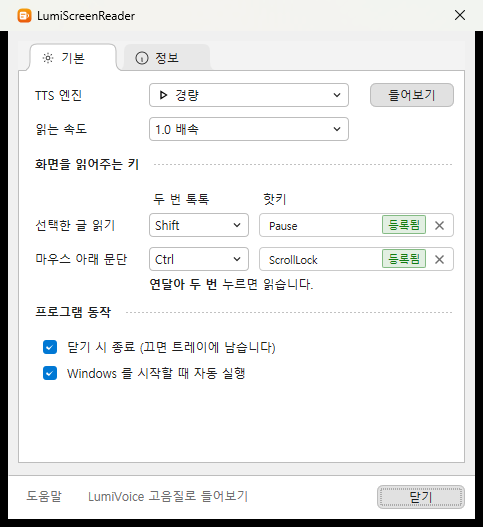
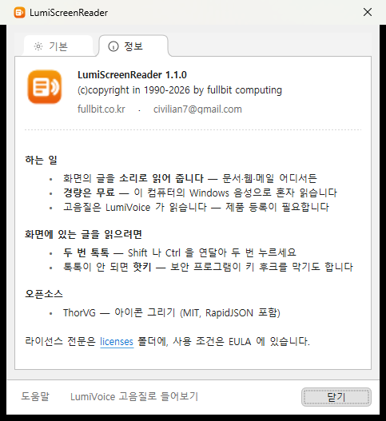

# LumiScreenReader

화면에 있는 글을 소리로 읽어 줍니다. 문서, 웹 페이지, 메일 등 어느 프로그램의 글이든 읽습니다.

  
   설정 창. 첫 줄에서 엔진과 읽는 속도를 고르고 「들어보기」로 바로 확인합니다.

## 받기

[**Releases**](../../releases) 에서 압축 파일을 내려받아 풀고 `LumiScreenReader.exe` 를 실행하면 됩니다.

## 프로그램 사용을 위한 조건

| | |
|---|---|
| 운영체제 | Windows 10 64비트 이상. Windows 11 에서도 그대로 씁니다. 32비트 Windows 에서는 동작하지 않습니다. |
| 음성 | 경량으로 읽으려면 Windows 에 한국어 음성이 하나 설치되어 있어야 합니다. 없으면 프로그램이 실행되지 않고 설치하는 곳을 안내합니다. |
| 고음질 | 같은 컴퓨터에 LumiVoice 가 설치되어 있어야 합니다. 그래픽 카드도, 인터넷 연결도 필요하지 않습니다. |
| 설치 | 압축을 풀고 실행하면 됩니다. 관리자 권한이 필요하지 않습니다. |

## 트레이와 설정 창

이 프로그램은 창을 띄워 놓고 쓰지 않습니다. 뒤에서 기다리다가 키를 누르면 읽어 주므로
평소에는 화면을 차지하지 않습니다.

| | |
|---|---|
| 처음 실행할 때 | 설정 창이 열립니다. 핫키를 정해야 쓸 수 있기 때문입니다. |
| 그다음부터 | 창 없이 트레이로 바로 들어갑니다. 작업 표시줄에도 나타나지 않습니다. 꺼진 것이 아니라 이미 대기 중인 상태입니다. |

트레이는 화면 오른쪽 아래, 시계 옆입니다. 아이콘이 보이지 않으면 시계 왼쪽의 `∧` 를 눌러
숨겨진 아이콘을 펼쳐 보십시오. Windows 11 은 새로 설치한 프로그램의 아이콘을 기본으로
그 안에 넣어 둡니다. 밖으로 끌어다 놓으면 계속 보입니다.

### 설정 창을 다시 열려면

| | |
|---|---|
| 설정 | 트레이 아이콘을 두 번 누릅니다. 오른쪽 클릭한 뒤 **설정…** 을 골라도 됩니다. |
| 종료 | 트레이 아이콘을 오른쪽 클릭한 뒤 **끝내기** 를 고릅니다. |

이미 실행 중일 때 프로그램을 다시 실행하면 두 개가 뜨지 않고, 먼저 떠 있던 쪽의 설정 창이
열립니다. 아이콘을 못 찾을 때 쓸 수 있는 방법입니다.

> 아이콘은 주황색입니다. LumiVoice 를 함께 쓰면 트레이에 두 개가 나란히 뜨는데 색이 달라
> 구별됩니다.

## 화면의 텍스트를 읽는 두 가지 방법

### 두 번 톡톡

<kbd>Shift</kbd> 나 <kbd>Ctrl</kbd> 을 연달아 두 번 가볍게 누릅니다.
어느 키로 무엇을 읽을지는 설정에서 따로 정합니다. 기본값은 <kbd>Shift</kbd> 가 선택한 글,
<kbd>Ctrl</kbd> 이 마우스 아래 문단입니다.

> 다른 키를 누르는 사이에 끼면 두 번으로 세지 않습니다. <kbd>Ctrl</kbd>+<kbd>C</kbd> 로
> 복사한 뒤 <kbd>Ctrl</kbd>+<kbd>V</kbd> 로 붙여 넣어도 읽기가 시작되지 않는 것은 그 때문입니다.

### 핫키

톡톡이 듣지 않을 때 쓰는 길입니다. 설정 창의 **핫키** 칸에 지정한 키를 누릅니다.
기본값은 선택한 글이 <kbd>Pause</kbd>, 마우스 아래 문단이 <kbd>ScrollLock</kbd> 입니다.
다른 프로그램이 거의 쓰지 않는 키입니다.

> 보안 프로그램이 키 후크를 막는 컴퓨터에서는 **두 번 톡톡이 동작하지 않습니다**.
> 핫키는 다른 방식으로 등록하므로 그런 곳에서도 쓸 수 있습니다 — 두 가지를 함께 두는 이유입니다.
>
> 노트북에는 <kbd>Pause</kbd>·<kbd>ScrollLock</kbd> 이 없을 수 있습니다. 그때는 다른 키로
> 바꾸십시오. 다른 프로그램이 이미 쓰고 있어 키를 잡지 못하면 칸 오른쪽에 **미등록** 이라고
> 표시됩니다.

## 읽는 범위

| | |
|---|---|
| 선택한 글 읽기 | 지금 블록으로 잡아 둔 글을 읽습니다. |
| 마우스 아래 문단 | 마우스 포인터가 가리키는 자리의 문단을 읽습니다. |

읽는 도중에 멈추려면 읽기를 시작한 키를 한 번 더 누릅니다. 핫키든 두 번 톡톡이든 같습니다.

## 읽는 속도

설정 창 첫 줄에서 **0.5 · 1.0 · 1.5 · 2.0 배속** 중에 고릅니다. 기본은 1.0 배속입니다.
경량과 고음질이 **같은 눈금**을 쓰므로 엔진을 바꿔도 빠르기가 튀지 않습니다.

그 옆의 **「들어보기」** 를 누르면 고른 엔진과 속도로 **지금 바로** 한 문장을 읽어 줍니다.
설정을 바꾸고 다른 창으로 갈 것 없이 그 자리에서 확인할 수 있습니다.

> 읽는 문장은 `assets\text\LumiScreenReader.txt` 에 있습니다. 마음대로 고쳐도 됩니다.

## 고음질 미리 듣기

프로그램 안의 **도움말** 에서 LumiVoice 없이도 고음질 목소리를 들어 볼 수 있습니다.
문서, 숫자와 시간, 메일 세 가지를 미리 만들어 넣어 두었습니다.

## 자주 묻는 질문

### 등록한 핫키를 지우려면

핫키 칸을 눌러 입력을 기다리는 상태로 만든 다음 <kbd>Backspace</kbd> 를 누릅니다.
<kbd>Esc</kbd> 는 취소이므로 원래 값으로 돌아갑니다.

### 글을 가져오지 못합니다

- 관리자 권한으로 실행된 창은 읽을 수 없습니다. Windows 가 권한이 낮은 프로그램의 접근을 막습니다.
- 글을 UI 자동화로 내주지 않는 프로그램이 있습니다. 그때는 <kbd>Ctrl</kbd>+<kbd>C</kbd> 로
  **복사해서** 읽습니다 — 따로 켤 것이 없습니다.
  다만 클립보드에 들어 있는 것이 텍스트가 아니면 복사하지 않습니다. 그 내용을 잃지 않기 위해서입니다.

### 소리가 나지 않습니다

- 설정의 **출력 장치** 가 지금 쓰는 스피커나 헤드셋인지 확인하십시오.
- 고음질을 골랐다면 LumiVoice 가 실행 중이어야 하고 제품 등록이 되어 있어야 합니다.
  조건이 맞지 않으면 읽지 않고 이유를 알려 드립니다.

### 경량과 고음질은 무엇이 다릅니까

| | 경량 | 고음질 |
|---|---|---|
| 비용 | **무료** | 제품 등록 필요 |
| 읽는 곳 | 이 컴퓨터의 Windows 음성 | LumiVoice |
| 다른 프로그램 | 필요 없음 | LumiVoice 가 실행 중이어야 함 |
| 반응 | 즉시 | 첫 문장에 준비 시간이 걸림 |

### 고음질을 쓰려면 인터넷이 필요합니까

필요하지 않습니다. LumiVoice 는 이 컴퓨터 안에서 음성을 만듭니다.

- 읽는 글이 바깥으로 나가지 않습니다. 화면 낭독은 문서나 메일처럼 남에게 보이면 안 되는
  내용을 읽는 일이므로, 이것을 전제로 만들었습니다.
- 인터넷이 끊겨 있어도 그대로 동작합니다.
- 쓴 만큼 내는 사용료가 없습니다. 한 번 설치하면 몇 자를 읽든 같습니다.

### 그래픽 카드가 있어야 합니까

필요하지 않습니다. CPU 만으로 동작합니다. 그래픽 카드가 있으면 긴 글에서 조금 더 빠르고
LumiVoice 설정에서 골라 쓸 수 있지만, 짧은 글은 오히려 CPU 가 빠릅니다.

### Windows 음성이 없다고 나옵니다

경량은 Windows 에 설치된 음성으로 읽습니다. 음성이 없으면 프로그램이 실행되지 않고 안내만 합니다.
**설정 → 시간 및 언어 → 음성 → 음성 관리 → 음성 추가** 에서 한국어 음성을 설치하십시오.

### 버전과 연락처는 어디서 봅니까

설정 창의 **「정보」** 탭에 있습니다. 오픈소스 고지로 가는 링크도 같은 자리에 있습니다.

  
   「정보」 탭. 버전, 연락처, 오픈소스 고지를 볼 수 있습니다.

### 창을 닫으면 종료됩니까

종료되지 않습니다. 트레이에 남아 핫키를 계속 기다립니다. 창을 닫을 때 함께 종료하고 싶으면
설정에서 **「닫기 시 종료」** 를 켜십시오.

## 만든 곳과 저작권

| | |
|---|---|
| 프로그램 | LumiScreenReader 1.1.0 |
| 만든 곳 | FullBit Computing |
| 홈페이지 | [fullbit.co.kr](https://fullbit.co.kr) |
| 문의 | <civilian7@gmail.com> |

이 프로그램과 문서의 저작권은 FullBit Computing 에 있습니다. 사용 조건은 [EULA.md](EULA.md) 에
적어 두었습니다.

남의 것으로 들어 있는 것은 아이콘을 그리는 [**ThorVG**](docs/ThorVG-MIT.txt)(MIT 라이선스,
RapidJSON 포함) 하나입니다. 고음질로 읽을 때 쓰는 음성 모델을 비롯해 LumiVoice 쪽에서 쓰는
것들의 고지까지 모두 배포물의 `licenses` 폴더에 원문 그대로 들어 있습니다.

> 읽은 글도, 사용 기록도 밖으로 내보내지 않습니다. 기록은 이 컴퓨터의 프로그램 폴더 안에만
> 남으며, 읽은 내용과 창 제목은 적지 않습니다.

## 이 저장소에 대하여

**소스는 공개하지 않습니다.** 이 저장소는 배포와 안내를 위한 자리이며,
실행 파일은 [Releases](../../releases) 의 압축 파일로만 제공합니다.

버그 신고와 요청은 [Issues](../../issues) 로 남겨 주십시오.

---

LumiScreenReader 1.1.0 · © 1990–2026 FullBit Computing
